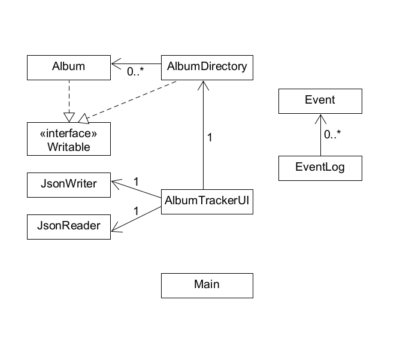

# Music Rating Application

## CPSC 210 Project - Robbie Laughlen

### What does this application do?

<p>This application is able to allow users to track and rate their favourite albums and EPs.
Additionally, it allows the user to create a list of albums to be listened to in the future.</p>
The database of albums will be able to be sorted by multiple different features, such as the rating given.


### Who will use this application?

Anyone interested in keeping track of the music they listen to.
Anyone looking to rate their music and keep a **sorted** database of their music.


### Why does this project interest me?
<p> I've always enjoyed keeping track of what I watch/listen to/play.
In particular, I am quite passionate about music and love to explore various albums.</p>
The ability to rate and sort albums would provide a way for me (and others!) to 
document what music they've been keeping up with recently.


### User Stories

*A few examples to show how someone can use this application to produce a specific outcome.*

**PHASE 1**

- As a user, I want to be able to add an album to the list of albums I've listened to ✅
- As a user, I want to be able to view the list of albums I've listened to ✅
- As a user, I want to be able to mark whether I've listened to an album or not
- As a user, I want to be able to remove an album from my list ✅
- As a user, I want to be able to see the total number of albums I've listened to
- As a user, I want to be able to rate my albums on a scale of 10 ✅
- As a user, I want to be able to sort my albums by rating and other details ✅

**PHASE 2**

- As a user, I want to be able to save my tracked albums list to file (if I so choose) ✅
- As a user, when I start the application, I want to be given the option to load my tracked albums list from file ✅

# Instructions for Grader

- You can generate the first required action related to adding Xs to a Y by submitting album data and clicking 'add album'
- **Instructions for adding an album:** Album must have a name. If listened is not ticked, then the rating doesn't matter. If listened is ticked, then give a rating from 0-10.

- You can generate the second required action related to adding Xs to a Y by selecting the albums you would like to remove on the table, and then clicking 'remove album'. (You can select multiple).

- You can locate my visual component by starting up the application, as I have a splash screen.

- You can save the state of my application by clicking the save button located at the bottom.

- You can reload the state of my application by clicking the load button located at the bottom.

**PHASE 4**

Task 2 - Event Log

```
All Events Logged: 
Tue Aug 08 20:09:48 PDT 2023
Album: DAMN added to album list with rating: 7.
Tue Aug 08 20:09:48 PDT 2023
Album: The White Album added to album list with rating: -1.
Tue Aug 08 20:09:48 PDT 2023
Album: Nurture added to album list with rating: 10.
Tue Aug 08 20:09:48 PDT 2023
Album: shaft* added to album list with rating: -1.
Tue Aug 08 20:09:54 PDT 2023
Album: Test1 added to album list with rating: 5.
Tue Aug 08 20:10:00 PDT 2023
Album: Test2 added to album list with rating: -1.
Tue Aug 08 20:10:11 PDT 2023
Album: Test3 added to album list with rating: 10.
Tue Aug 08 20:10:13 PDT 2023
Album: Test2 removed from album list.
Tue Aug 08 20:10:25 PDT 2023
Album: Test4 added to album list with rating: 3.
Tue Aug 08 20:10:29 PDT 2023
Album: Test1 removed from album list.
Tue Aug 08 20:10:29 PDT 2023
Album: Test3 removed from album list.
Tue Aug 08 20:10:29 PDT 2023
Album: Test4 removed from album list.

Process finished with exit code 0
```

Task 3 - UML Diagram



Task 3 Part - Reflection

I would refactor the following given more time:

**Album**
- I had to override the album constructor to provide two different functionalities, one with an id and one without. This was implemented to ensure order is maintained due to the sorting based on rating/recency. I would instead implement this within the AlbumDirectory class with a simpler sorting method.
- This overriding of the constructor also led to the id being -1 when added without an id, which caused confusing in the code. Ideally I'd add an iterator that allocates a new larger value if an id is not given.

**AlbumDirectory**
- As my album directory got increasingly complicated, I feel I strayed from the Single Responsibility Principle. I could possibly integrate a DirectoryManager which would sort out the albums.
- Additionally, I had two album add methods, and two remove album methods. For clarity, I would use only a single removal method, as I needed two when my UI was made.
- Furthermore, I could use a single addNewAlbum method, creating the album initially, and then adding it. The fact that I required multiple add album methods indicated that my code was poorly organized.

**AlbumTrackerUI**
- For my UI, while I felt my method choices made sense, I also feel that I could make some of my conditions far less complicated. I had many nested if else statements to factor in for incorrect inputs. I could refactor those out into separate methods.
- Additionally, I could separate some of the methods for loading different JSwing components, which would increase my cohesion and also make the code clearer for anyone trying to refactor later. For instance, splitting Table and Input into separate categories based on their functions.
- Finally, my splash screen should NOT use Thread.sleep to briefly show the image, there are likely better and less risky methods to show a temporary image. For instance using the in-built Java splashscreen package (although it is quite complicated!)